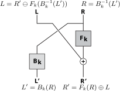
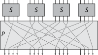

<!M GFMTexBlock>
<!M PunctuationCompression>

# Philox

Philox 是一种基于计数器（counter-based）的随机数生成算法，在 [Parallel Random Numbers: As Easy as 1, 2, 3](https://www.thesalmons.org/john/random123/papers/random123sc11.pdf) 这篇论文中提出。

## 基于计数器的随机数生成

通常的随机数生成生成下一个随机数的计算需要上一个随机数的结果，这就意味着要算出第 n 个随机数就必须要算出前 n-1 个数。但是基于计数器的随机数生成算法输入 n 就可以直接计算出第 n 个随机数，非常适合并行计算，例如 pytorch 中 cuda 上的随机数操作内部就使用了 curand 的 Philox4×32-10 版本实现。

## 引出问题

要实现这个功能，需要找到一个函数满足输入一个 index 和 seed 得到一个 random 结果，而且通过结果不能猜到输入，同时结果需要足够均匀分散。观察这个需求（瞄一眼论文）可以注意到正好有现成的一些函数能满足：加密函数或者哈希函数。

文中首先直接拿了 AES 和 Threefish 这两个加密算法做随机数生成，作为对称加密算法，在 key 固定的情况下输入和输出就是一一映射，都很容易通过随机数碰撞测试。根据文章的研究，先前就有很多此类的研究了，也包括用 SHA、MD5 之类的哈希函数，但是最主要的问题是此类函数的计算量都太大了，性能不如传统的随机数算法。论文的做法是削减算法的计算量，对于原本的加密用途来说，这会影响算法的安全性，但是对于生成随机数来说没有这样高的要求。在介绍论文是怎么做的之前，要先了解一下加密算法里都在做些什么计算。

## 加密函数

主流常见的对称加密算法采用迭代密码的一种方法，即使用一个较为简单的双射函数（称之为轮函数）然后不断的重新调用这个函数，迭代若干次作为最后的结果。其中轮函数有两个常见的形式：Feistel 密码和代换-置换网络（Substitution-Permutation Network）。

### Feistel 密码

Feistel 密码的计算结构如图所示。将数据前后分成 L 和 R 两部分，Fk 和 Bk 是两个和密钥相关的函数，Fk 不要求有逆函数，Bk 则要求是双射函数（通常 Bk 函数会直接被省略），⊕ 是一个群运算符（例如异或运算），⊖ 是其逆操作。



### 代换-置换网络

代换-置换网络（后文简称 SP-Network）由 S-box 代换盒和 P-box 置换盒组成，通常 S-box 是一个较小的查找表，例如 DES 中对于 64bit 就是分成 8 个不同的 8bit 大小的查找表，当然一个普通的一一映射函数也可以作为 S-box。在实际的加密算法中通常会混合使用这两种结构，比如用 SP-Network 作为 Feistel 中的 Fk。



## 解决方法

作者的想法是将原始加密算法中的迭代次数减少，作者测试了 AES，改为迭代 5 次同时简化每轮中 key 的计算（具体见 Philox）既可以通过随机数碰撞测试也同时具有不错的性能，但是这个是依赖于 cpu 提供了 AES 加速指令（虽然现代主流的 cpu 都有提供）。 

### Threefry

作者又找来了 Threefish 加密算法。Threefish 被设计应用于 Skein 哈希算法中。Threefish 主体是 SP-Network，以及开始与每 4 轮会与 subkey（由 key 和 tweak 数据计算得到）进行一次加法。但是 Threefish 中 S-box 没有选择常规的查找表，而是使用了异或和位移运算，为了避免缓存时序攻击；而且 Threefish 的 P-box 是 WORD 粒度的置换，实现时可以无需任何计算。由此，Threefish 的实现中只需要整数加法、异或和位移计算，无需特别的指令支持。Threefish 对于 256bit 的数据会进行 72 轮迭代，作者将迭代次数砍到了 12～20 次，同时把 tweak 数据也直接设为了 0，提出了 Threefry 随机数算法。

### Philox

相对于 Threefry，作者设想一种迭代次数较少（6～10 轮）但迭代计算可以相对更复杂些的方案：Philox。保持 Threefry 中的 P-box 不变，但 S-box 换成 Feistel 函数，`Bk = mullo(R, M); Fk = mulhi(R, M) ^ k`，在乘法指令中 lo 和 hi 的结果是同时得到的，所以一个 S-box 的计算就只要一条整数乘法与两条异或指令。作者给出了不同输入大小的一些常数 M 值的选择；对于每轮 k 的计算和作者修改 AES 中的方法一致。作者根据 Weyl 序列采用了每轮加上一个常数的方法（首轮就是随机数的 seed）得到 k，选择了 √3 - 1（0xBB67AE8584CAA73B）和黄金比例（0x9E3779B97F4A7C15）作为高一半和低一半的相加常数。Philox 里先做 P-box 再做 S-box，P-box 在 4 组的情况下是 `(0, 1, 2, 3) -> (2, 1, 0, 3)`，0 是最低，3 是最高。下面是 Philox-4x32-10 的实现，命名中的 NxW-R 表示 P-box 置换单元是 W bit，一个 S-box 处理 2W bit，总输出输出 NW bit，迭代 R 轮。

```cpp
const uint32_t K_LO = 0x9E3779B9;
const uint32_t K_HI = 0xBB67AE85;
const uint32_t M0 = 0xCD9E8D57;
const uint32_t M1 = 0xD2511F53;

struct u32x2 { uint32_t x, y; }; // x -> w, lo -> hi
struct u32x4 { uint32_t x, y, z, w; };

u32x2 u32mul(uint32_t a, uint32_t b) {
    uint64_t r = (uint64_t)a * (uint64_t)b;
    return {(uint32_t)r, (uint32_t)(r >> 32)};
}

u32x4 single_round(u32x4 cnt, u32x2 key) {
    u32x4 p = {cnt.z, cnt.y, cnt.x, cnt.w};
    u32x2 s0 = u32mul(M0, p.x);
    u32x2 s1 = u32mul(M1, p.z);
    return {s0.y ^ p.y ^ key.x, s0.x, s1.y ^ p.w ^ key.y, s1.x};
}

u32x4 Philox4x32_10(u32x4 count, u32x2 seed) {
    for (int i = 0; i < 10; i++) {
        count = single_round(count, seed);
        seed.x += K_LO; seed.y += K_HI;
    }
    return count;
}
```

## 扩展

作为加密函数，它是要能解密的，所以基于加密函数设计的 Philox 也可以有一个解密函数，把随机数和 seed 输入进去可以返回是第几个随机数。根据 Feistel 函数，只需要提供 Bk 的逆函数即可，而刚好 M 两个系数都是可以找到逆元的，M0 的逆元是 0x6D7CAE67，M1 的逆元是 0x991A7CDB。不过这个需要完整的随机数输出，像 pytorch 里生成 4x32 bit 只用低 32bit 而且还要重新映射范围和分布的就不可能能准确回推了。

```cpp
const uint32_t M0_INV = 0x6D7CAE67;
const uint32_t M1_INV = 0x991A7CDB;

u32x4 single_round_inv(u32x4 cnt, u32x2 key) {
    uint32_t r0 = u32mul(M0_INV, cnt.y).x;
    uint32_t r1 = u32mul(M1_INV, cnt.w).x;
    uint32_t l0 = u32mul(r0, M0).y ^ cnt.x ^ key.x;
    uint32_t l1 = u32mul(r1, M1).y ^ cnt.z ^ key.y;
    return {r1, l0, r0, l1};
}

u32x4 Philox4x32_10_decrypt(u32x4 count, u32x2 seed) {
    seed.x += 10 * K_LO; seed.y += 10 * K_HI;
    for (int i = 0; i < 10; i++)
    {
        seed.x -= K_LO; seed.y -= K_HI;
        count = single_round_inv(count, seed);
    }
    return count;
}
```
