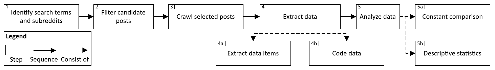
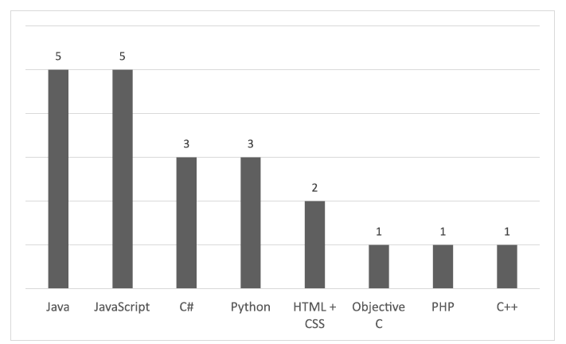
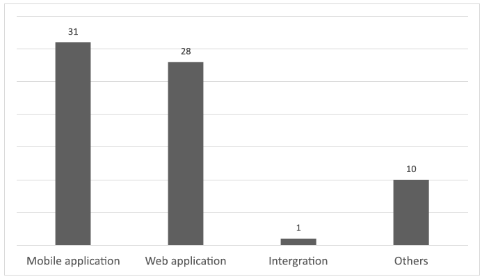
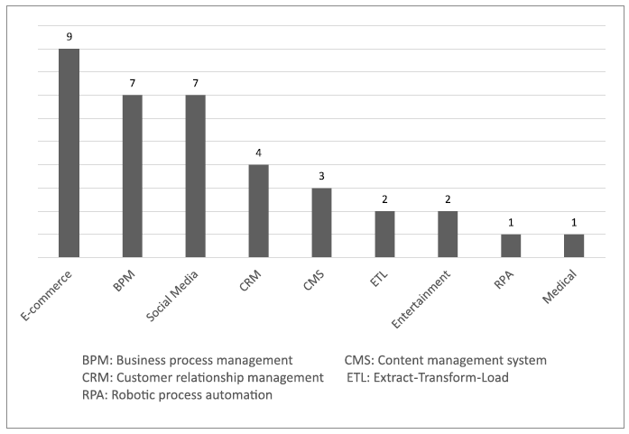

<!M PunctuationCompression>

# 低代码开发的特点和挑战：来自从业者的视角

**论文来自：**

> Yajing Luo1, Peng Liang1∗, Chong Wang1, Mojtaba Shahin2, Jing Zhan3. 2021. Characteristics and Challenges of Low-Code Development: The Practitioners’ Perspective. In ACM / IEEE International Symposium on Empirical Software Engineering and Measurement (ESEM) (ESEM ’21), October 11–15, 2021, Bari, Italy.ACM, New York, NY, USA, 11 pages. https://doi.org/10.1145/3475716.3475782

通过 Google 翻译结合人工润色。本人毕业设计外文翻译作业。不像深度学习，低代码这个领域基本没有多少文献，大部分找到的都是调查报告之类的文献。

### 摘要

**背景**：近年来，低代码开发（LCD）发展迅速，Gartner 和 Forrester 均预测 LCD 的使用前景非常广阔。微软、Mendix 和 Outsystems 等巨头公司也推出了他们的 LCD 平台。

**目标**：本文中，我们研究了两个流行的在线开发人员社区 Stack Overflow（SO）和 Reddit，以了解从业者对于 LCD 特点和挑战的见解。

**方法**：我们使用两个 LCD 相关的术语来搜索 SO 中的相关帖子，并提取了 73 个帖子。同时，我们从 Reddit 中探索了三个与 LCD 相关的子版块，并收集了 228 个帖子。我们从这些帖子中提取数据，并应用持续比较（Constant Comparison）法来分析 LCD 的概念、优势、局限性和挑战。对于 LCD 中所使用的平台和编程语言、LCD 中的实现单元（implementation units）、LCD 的底层技术（supporting technologies）、由 LCD 开发的应用的类型、使用 LCD 的领域，我们采用描述性统计（descriptive statistics）的方式进行分析和展示结果。

**结果**：我们的发现表明：(1) LCD 可以提供图形用户界面供用户拖放操作，并且几乎或根本不需要代码；(2) LCD 平台中开箱即用的工具（例如，API 和组件）使其易于学习和使用，并能够加快开发速度； (3) LCD 在需要由自动化的流程和工作流的领域尤其受到青睐；(4) 从业者对 LCD 的优缺点看法不一。

**结论**：我们的研究结果表明，研究人员在提及 LCD 时应明确定义术语，开发人员应考虑 LCD 的特性是否适合他们的项目。

### 关键词

低代码开发，Stack Overflow，Reddit，实证研究

## 引言

随着互联网的发展和数字化浪潮，企业越来越需要对不断变化的市场需求做出快速和灵活的响应 \[15]。据研究公司 Gartner 称，到 2021 年，因为员工数量增加的速度不够快，对信息系统需求的增加速度将比 IT 部门提供能力的增长速度快了五倍 \[18]。此外，由于高需求而低供给，招聘软件工程师变得越来越困难 \[17]。为了解决上述的问题并适应这个快速发展的世界，企业正在寻找更快、更便宜的方法来满足他们的软件需求 \[7]。于是，低代码开发 (LCD) 平台应运而生，它承诺组织可以聘请没有编码经验的业务人员来构建应用程序 \[7]。

Forrester Research 于 2014 年首次向公众介绍了“低代码”一词 \[13]，该术语指出，公司更愿意选择低代码替代方案，以实现快速、持续、测试中学习（test-and-learn）的交付方式。Forrester \[12] 进行的调查也表明，LCD 平台可以将开发速度提高 5 到 10 倍。此外，这些平台还为企业提供了一种更经济的方式来满足市场或企业内部的需求 \[15]。尽管 LCD 在产业上蓬勃发展，但人们对 LCD 的认识和实践并不充分。为此，我们计划从从业者的角度来探讨 LCD 的特点和挑战。

为了获得从业者的意见，我们调查了在线开发者社区。Stack Overflow 作为在线开发者社区之一，自 2008 年以来一直是最受欢迎的和使用最广泛的开发者问答平台 \[9]。SO 有数百万软件从业者交流知识、分享经验、讨论他们在软件开发活动中遇到的问题。此外，Reddit 是一个由不同兴趣的子版块组成网络，成员可以在该站点发布内容，例如链接、文本帖子、图像和视频，然后由其他成员投票表示赞成或反对。此外，这些帖子依据主题组织到用户创建的称为“subreddits”的版块中，其中涵盖了包括软件开发在内的各种主题。简而言之，我们从 SO 和 Reddit 收集数据，然后从选定的帖子中提取数据项，并使用持续比较法和描述性统计法对其进行分析。

**本文的贡献**：(1) 我们探讨了从业者如何根据他们的理解来描述 LCD；(2) 我们对 LCD 的特点进行了分类和分析，包括平台、编程语言、实现单元、底层技术、应用的类型和领域；(3) 我们还收集了开发者对 LCD 优缺点的看法。

本文结构如下：第 2 节介绍相关研究。然后在第 3 节阐述了研究的问题和方法设计。第 4 节提供研究结果，然后在第 5 节讨论结果。结果有效性的潜在威胁在第 6 节中介绍，然后在第 7 节中以未来的工作方向结束了本文。

## 相关研究

### 低代码开发

多项研究都集中在 LCD 的主题上。Waszkowski \[18] 描述了 Aurea BPM 低代码平台在制造业中自动化业务流程的使用。Sahay et al. \[14] 基于拟议的概念比较框架展示了一份不同 LCD 平台的技术调查。Alamin et al. \[2] 也进行了关于开发者对 LCD 挑战的讨论的实证研究，但是我们研究的问题和 Alamin et al. 研究的完全不相同。Alamin et al. 的研究 \[2] 重点关注于 SO 中讨论了哪些 LCD 相关话题，这些主题如何分布在 LCD 的生命周期阶段中以及哪些 LCD 话题最满意解答；我们的研究更注重给出对于 LCD 描述和特点的见解，以及使用 LCD 带来的利弊。此外，我们没有像 Alamin et al.的工作 \[2] 一样仅从一个数据源 SO 获取数据，而是从 SO 和 Reddit 收集数据，以提高研究结果的外部有效性。此外，Alamin et al. \[2] 使用 LCD 平台名称作为标签（例如，“appmaker” 表示 Google Appmaker），并基于标签在 SO 中进行了搜索，并将搜索结果收集为他们的数据集。但是我们只在 SO 中进行了基于关键词的搜索，因为我们认为使用这些 LCD 平台标签收集的帖子可能会偏向于特定的 LCD 平台，这将影响到结果的普适性。

据我们所知，目前还没有研究在实践中探讨对 LCD 的理解和描述。在我们的研究中，我们提出了九个研究问题，旨在全面概述 LCD 的特点，包括其描述、平台、编程语言、实现单元、底层技术、应用的类型、领域、优势以及它面临的挑战。

### 在软件工程中使用在线开发者社区

近年来，数以百万计的软件开发人员活跃在在线开发者社区中解决问题和分享想法。这成为研究人员研究软件工程特定主题的重要资源。

例如，Stack Overflow 已经成为最受欢迎的专业问答网站，可以从研究人员和从业者那里获得答案和意见。Abdellatif et al. \[1] 调查了 Stack Overflow 上与聊天机器人相关的帖子，以了解聊天机器人开发中讨论的主要话题。Chatterjee et al. \[5] 从个人寻求编程错误帮助的角度关注 Stack Overflow。Cummaudo et al. \[6] 使用 Stack Overflow 来挖掘开发人员在使用计算机视觉服务时受阻的情况，而 Zahedi et al. \[21] 通过从 Stack Overflow 中挖掘相关帖子来探索持续软件工程的各个方面。此外，其他流行的在线开发者社区也被用于软件工程的研究。例如，Li et al. \[10] 选择 Reddit 作为收集与架构侵蚀相关讨论的数据源之一，以研究架构侵蚀的概念、原因、后果、检测和控制。

鉴于 SO 和 Reddit 包含大量基于从业者想法的问答形式的数据，我们决定使用这两个在线开发者社区作为我们的数据源来进行 LCD 的研究。

## 方法论

我们根据目标-问题-度量方法（Goal-Question-Metric）\[3] 设定了本研究的目标：**为了**得到从从业者的**角度**对 LCD 的各个方面的特定的看法，**结合** SO 和 Reddit 上有关 LCD 的帖子，**分析**业界对 LCD 的见解。在下面的小节中，我们将阐述待研究的问题、设计问题的理由以及研究过程（参见图 1）。

图 1：研究过程的总览

### 研究的问题

**问题 1：对 LCD 的理解**

*设计理由*：从业者根据自身经验和预期，对 LCD 有着不同的理解，在实践中他们也使用了不同的近义词来指代 LCD，例如 “no-code development” 和 “zero-code development”。此问题旨在得到从业者对 LCD 的理解。

**问题 2：LCD 中使用的平台有哪些**

*设计理由*：LCD 平台提供专用于 LCD 的集成开发环境。存在许多为 LCD 提供各种功能的平台。此问题旨在确定流行的 LCD 平台及其功能。

**问题 3：LCD 使用了哪些编程语言**

*设计理由*：LCD 帮助从业者以编写更少的代码，而开发人员有时仍需要进行一些手工编码。此 问题 探讨了在 LCD 中因各种目的（例如，自定义功能）所使用的编程语言。

**问题 4：LCD 主要的实现单元是什么**

*设计理由*：此问题旨在了解 LCD 中代码的抽象层级。换句话说，开发是基于什么尺度的实现（例如，基于组件或基于框架）。

**问题 5：LCD 使用了哪些底层技术**

*设计理由*：为了最少的手工编码和其他优势，LCD 需要采用某些底层运行环境的支持。此问题旨在确定 LCD 中使用的底层技术。

**问题 6：使用 LCD 开发的应用类型有哪些**

*设计理由*：许多 LCD 平台已上市并在工业中使用。这些平台可能适合开发不同类型的应用程序（例如，移动应用程序、桌面应用程序和 Web 应用程序）。此问题旨在概述使用 LCD 开发的应用程序类型。

**问题 7：使用 LCD 的领域有哪些**

*设计理由*：LCD 已用于开发各个领域（例如，金融、电信）的应用程序。此问题旨在调查这些应用程序的领域，以及哪些领域适合使用 LCD 进行开发。

**问题 8：LCD 的优势有哪些**

*设计理由*：LCD 作为一种新兴的软件开发范例可以带来许多好处（例如，减少时间和成本）。此问题旨收集应用 LCD 给系统开发带来的好处。

**问题 9：LCD 的不足和挑战有哪些**

*设计理由*：LCD 还处于实践的早期阶段，局限性很多，同时也带来了传统开发中没有遇到的问题。这个问题的答案将帮助从业者在决定是否在他们的项目中使用 LCD 时做出明智的决定。

### 数据收集和过滤

为了回答这些问题，我们需要收集从业者关于 LCD 的知识、意见和经验。如 2.2 节所述，SO 和 Reddit 包含大量来自从业者的问答形式的数据，我们决定选择这两个网站作为我们研究的数据源，并在 2021 年 1 月至 2021 年 4 月间进行了数据收集 .

#### 搜索和收集候选的帖子

我们从搜索互联网上现有的关于的“low-code”文献开始。我们将这些同义词（即“low-code”、“zero-code”和“no-code”）做为搜索词.

**对于 SO**, 在尝试搜索的过程中，我们发现一些从业者在 SO 中使用 LCD 平台名称作为标签，例如，“outsystems” 代表 OutSystems 平台 \[^1]。但是，我们认为引入 LCD 平台名称作为搜索词会偏向于特定的 LCD 平台，从而影响到搜索结果。因此，我们决定不在搜索词中包含这些 LCD 平台名称。

由于基于关键词的挖掘方法的有效性在很大程度上取决于是否有一组合适的关键词，因此我们在基于关键词搜索 SO 的过程中应用了 Bosu et al. 的方法 \[4] 来确定我们研究中所需的关键词。步骤如下（以下几个步骤中使用了 NLTK 包 \[^2]）：

(1) 我们创建了一个初始的关键词集合（例如 “low-code”，“zerocode”和“no-code”）。

(2) 我们使用这组初始关键词搜索 SO 社区，以构建语料库，每个收录的帖子至少包含一个关键词。

(3) 我们将所有单词都转换为小写。然后我们通过删除所有标点符号和数字来清洗语料库。接下来，我们使用 NLTK 库从语料库中删除停用词（stopwords）。最后，我们创建了一个令牌列表。

(4) 我们应用 Porter stemming 算法 \[19] 来获取每个标记的词干（例如：plays，played，playing 都变成了 play）。

(5) 我们从语料库中创建了一个文档-术语矩阵（Document-Term matrix） \[16]。

(6) 我们检查是否有任何其他词经常与我们的初始关键词同时出现。如果同时出现概率高于 0.05，则可以考虑将其纳入关键词集中。

(7) 我们手动分析了所有频繁同时出现的其他词，以决定是否加入到最终的关键词集中。

执行上述步骤后，我们没有发现任何与每个初始关键词同时出现的其他关键词。所以我们认为我们原来的关键词集是足够全面的。

接下来，为了使搜索结果更加精确，我们对搜索词进行了细化和缩小。由于 SO 提供了高级搜索功能，我们可以在引号中输入关键词来搜索特定的短语，因此我们首先使用这个方法搜索了关键词。粗略浏览搜索结果后，我们发现其中包含了一些不相关的结果。因此，我们通过在搜索查询中使用“-”来排除不相关的结果。例如，我们在“low code”的搜索结果中发现了一些与我们的主题无关的“low code coverage”相关帖子。因此，我们将搜索字符串更改为“low code”-“low code coverage”，排除了“low code coverage”相关的帖子。

然后我们进行了数据提取试验。第一作者从所有搜索词的搜索结果中随机抽取 10 个帖子。目的是验证我们选择的搜索词是否合适，以及是否可以从搜索获得的帖子中提取数据项。接下来，第一作者从这 10 篇帖子中抽取数据，然后与第二作者讨论抽取结果，看抽取结果是否正确。此外，由于我们通过搜索词“no-code”获得了 19,455 个检索结果，我们检查了前 500 个检索到的帖子，发现只有 6 个 LCD 相关帖子（1.2％），考虑到 SO 已经根据它们与搜索词的相关性对搜索结果进行排名，而搜索得到的有效内容占比太低，我们决定在数据收集步骤中删除搜索词“no-code”获得的帖子。表 1 列出了使用的搜索词及其从 SO 中检索到的帖子数量。

**对于 Reddit**，在探索 Reddit 上的子版块后，找到了名为“Low Code” \[^3]、“No Code” \[^4] 和“nocodelowcode” \[^5] 的三个子版块，其中包含关于 LCD 的问题和讨论。然后我们选择了这三个子版块中的所有帖子作为我们数据源的一部分。表 2 列出了子版块及其在 Reddit 中的帖子数量。

#### 过滤候选帖子

过滤帖子的标准定义如下：(I1) 如果帖子包含至少一个要提取的数据项，如表 3 中所列，我们将其包括在内。(E1) 如果帖子的主题与 LCD 相关，但没有提供任何有用的信息，我们将其排除。(E2) 如果帖子仅包含视频或链接，没有可提取的数据项，我们将其排除（我们不从视频或链接中提取数据）。这一步是由第一作者进行的，因为 LCD 是一个简单的概念，这些标准很容易检查，只有少数第一作者无法决定的帖子才与第二作者讨论以达成共识。在排除搜索结果中不相关的帖子后，我们最终从 SO 和 Reddit 的 1574 篇帖子中得到 301 篇与 LCD 相关的帖子。SO 和 Reddit 的详细信息分别如表 1 和表 2 所示。

表 1：Stack Overflow 中使用的搜索词

|#|搜索词|检索到的帖子数|选中的帖子数|
|-|-|-|-|
|ST1|“low code”-“low code coverage”|127|46|
|ST2|“zero code”-“non zero code”-“zero code coverage”-“zero code change”-“zero code changes”-“zero code solution”|402|27|
|总计||529|73|

\[^1] 请注意，搜索词中的连字符“-”对 SO 的搜索结果没有影响。例如，搜索“low-code”和“low code”得到相同的搜索结果。

表 2：Reddit 中使用的子版块

|#|子版块|帖子的数量|选中的帖子数|
|-|-|-|-|
|SR1|Low Code|52|23|
|SR2|No Code|937|199|
|SR3|nocodelowcode|56|6|
|总计||1045|228|

### 数据提取和分析

#### 提取数据

为了回答第 3.1 节中的 问题，我们从选定的帖子中提取了表 3 中列出的数据项。在此过程中，第一作者和第五作者独立进行了 10 篇帖子的数据抽取试点，就抽取结果不一致的地方与第二作者进行讨论，并达成共识。他们根据其余选帖的数据项进一步提取数据，标记不确定的段落，然后与第二作者进行讨论。第一作者重新检查了所有帖子的提取结果，以确保正确提取所有数据。

表 3：提取的数据项和对应的问题

|#|数据项|描述|问题|
|-|-|-|-|
|D1| LCD 的描述|从业者基于他们的理解对 LCD 的描述|问题 1|
|D2|LCD 中使用的平台|LCD 中使用的平台|问题 2|
|D3|LCD 中使用的编程语言|LCD 中使用的编程语言|问题 3|
|D4|LCD 的实现单元|LCD 基于的实现单元|问题 4|
|D5|LCD 的底层技术 of LCD|LCD 背后底层技术|问题 5|
|D6|应用类型|LCD 开发的应用程序类型|问题 6|
|D7|领域 |LCD 应用的领域|问题 7|
|D8|LCD 的优势|LCD 带来的优势| 问题 8|
|D9|LCD 的不足和挑战|LCD 存在的不足和未来的挑战|问题 9|

#### 分析数据

对于 问题1、问题8 和 问题9，我们用持续比较方法 \[8] 进行定性数据分析。我们的分析过程包括以下步骤：(1) 第一作者从爬取的帖子中收集数据（包括标题、问题、评论和所有答案）。(2) 第一作者用编码标记帖子，并简洁地总结了数据项（用于回答问题）。(3) 第一作者将所有编码归为更高层次的概念并归类，然后第二作者检查编码结果，进一步讨论编码和分类结果的分歧，直到两位作者达成一致。为了有效地对数据进行编码和分类，我们使用了定性数据分析工具 MAXQDA \[^6]。对于其他 问题，我们使用描述性统计来分析和呈现结果。用于各个数据项的数据分析方法及其相应的问题列于表 4。本研究的所有数据和编码结果均已在线分布以供复制 \[11]。

表 4：数据项，其分析方法和对应的问题

|#|数据项|数据分析方法|问题|
|-|-|-|-|
|D1| LCD 的描述 |持续比较 |问题 1|
|D2| LCD 中使用的平台 |描述性统计 |问题 2|
|D3| LCD 中使用的编程语言|描述性统计| 问题 3|
|D4| LCD 的实现单元 |描述性统计| 问题 4|
|D5| LCD 的底层技术 |描述性统计 |问题 5|
|D6| 应用类型 |描述性统计| 问题 6|
|D7| 领域 |描述性统计 |问题 7|
|D8| LCD 的优势|持续比较 |问题 8|
|D9| LCD 的不足和挑战|持续比较| 问题 9|

## 结果

在本节中，我们将介绍九个问题的结果。对于每个问题，我们首先解释用于回答问题的分析方法，然后再展示结果。

**问题 1：对 LCD 的理解**

为了回答问题 1，我们应用持续比较法对提取的数据进行分析。我们最终提取了 106 个从业者根据其理解来描述 LCD 的例子，并将它们分为 11 种类型，如表 5 所示。

我们发现绝大多数的从业者倾向于使用*低代码*（例如“*编码工作量低*”）来描述 LCD。换句话说，他们认为 LCD 中的编码工作量很少。术语*拖放*排在第二位，紧跟其后的是*可视化编程*。一些从业者也使用*预设计的模板*，*对非专业程序员优化*，*所见即所得（WYSIWYG）*和*业务流程*来说明他们对 LCD 的理解和看法。其他一些人认为 LCD 利用*图形用户界面*来开发程序，一个用例是*构建自动化工具*来实现“*以最少的人工实现自动的无人值守操作*”。他们还认为 LCD 为*数据库操作*带来了便利。例如，一位从业者提到“*它提供了一些很酷的工具，可以通过脚手架生成 CRUD 实体*”。只有一位开发人员在帖子中评论说 LCD “*结合了视觉和代码工作流以促进在同一环境中的协作*”。

表 5：从业者用于描述 LCD 的术语

|术语|例子|次数|
|-|-|-|
|低代码|你不需要太多的编程技巧，你不需要编码就可你的工作流程|24|
|拖放|可能可以通过拖放来完成所有事情|23|
|可视化编程|低代码是一种可视化的软件开发方法|16|
|预设计|模板为业务用户到高级开发人员的每个人提供了正确的自动化画布来构建出色的软件机器人|10|
|非专业人士| 这对于编码技能有限的人或想要快速自动化某些东西而不必考虑开发所有方面的开发人员特别有用，例如部署，安防，...|9|
|所见即所得|意味着 WYSIWYG 的应用制作工具|7|
|业务流程| 专为业务流程人员设计 |6|
|图形用户界面| 为你提供一个可视化的助手| 5|
|构建自动化工具|最少的人工实现自动的无人值守操作|3|
|数据库操作|它提供了一些很酷的工具，可以通过脚手架生成 CRUD 实体|2|
|同一环境中协作|结合了视觉和代码工作流，允许设计师、开发人员和低代码用户在单一环境中协同工作|1|

**问题 2：LCD 中使用的平台有哪些**

为了回答问题 2，我们从所有帖子中手动标记了 LCD 中使用的平台，然后对它们进行了分析。在标记过程中，如果某个平台在同一个帖子中被多次提及，则只计算一次。我们统计了帖子中提到不同平台的次数，列出了开发它们的公司，并探究它们是开源许可的还是商业许可的。出现 10 次或以上的平台如表 6 所示。我们还根据 LCD 开发的应用程序方向对平台进行了分类，如表 7 所示。

关于表 6，在我们列出的 21 个（提到超过 10 次的） LCD 平台中，其中 14 个是商业许可的，7 个是开源许可的。关于表 7，我们确定了 137 个（至少提及一次的）平台，它们分为 LCD 开发的应用程序的七个方向，未提及的方向和其他方向。未提及的方向意味着我们没有从这些平台的官方网站或开发者的描述中找到答案。其他方向是指那些平台不属于上述任何类别。请注意，一个平台可以用于开发具有 LCD 的多个部分，因此可以分为多个类别（例如，Airtable、Bubble.io 和 Webflow），计数总数（218）大于平台数（137).

表 6：LCD 中使用的平台，所属企业，许可类型和出现次数

|平台名|企业名|许可类型|次数|
|-|-|-|-|
|Bubble.io |Bubble| 商业许可| 96|
|Webflow| Webflow Inc.| 商业许可| 63|
|Adalo |Adalo |商业许可| 50|
|Airtable| Airtable |商业许可 |45|
|Appgyver| Appgyver |开源许可|38|
|Glide |Glide |开源许可 |27|
|Wix (Editor X)| Wix.com Inc.| 商业许可| 19|
|Power Apps| Microsoft| 商业许可| 18|
|Zapier |Zapier| 商业许可| 17|
|DronaHQ |Deltecs InfoTech Pvt. Ltd. |商业许可 |17|
|WordPress |WordPress Foundation| 开源许可| 16|
|Softr.io| Softr |商业许可 |16|
|Backendless |Backendless |开源许可| 16|
|Appsheet |Google| 商业许可 |16|
|Outsystems |Outsystems| 商业许可| 12|
|Thunkable |Thunkable |商业许可| 11|
|Draftbit |Draftbit |开源许可| 11|
|Xano| Xano Inc. |商业许可 |10|
|Wappler.io| Wappler|开源许可|10|
|Shopify| Shopify| 商业许可 |10|
|Integromat| Celonis GmbH |开源许可|10|

表 7：根据开发的应用方向分类的 LCD 平台

|开发的应用方向|平台名| 数量|
|-|-|-|
|前端|Adalo, Alpha Software, Andromo, Anvil, App maker, Appgyver, Appian, Apprat, Appsheet, AppyPie, Backendless, BettyBlocks, Bildr, Bravo Studio, Bubble.io, CalcuBuilder, Carrd, Caspio, Draftbit, DrapCode, Dribble, DronaHQ, Elementor, Expression Blend, Figma, Fliplet, FlutterFlow, Kony Visualizer, Mendix, Noloco, Outsystems, PixelCraft, Pory.io, Power Apps, pxCode, Reach.at, Retool, Softr.io, Stacker, Storyboard, Tadabase, Thunkable, UI Bakery, Undaku, Unqork, V One, Verastream Host Integrator, Wappler.io,WaveMaker, Webase, Webflow, Weflow, WeWeb, Wix, WordPress, Zyro|56|
|工作流|Activiti, Airtable, Amazon Honeycode, Appian, Automate.io, AwareIM, Azure Logic Apps, Bonitasoft, Boomi Flow, Bubble.io, Budibase, Camunda, DronaHQ, Drupal, Google Tables,Parabola, Intalio, Integromat, jBPM, Joget, Knack, MakerPad, Mendix, N8n, Node-RED, Outsystems, Pega, Pory.io, Power Apps, Power Automate, Quickbase, Salesforce, ServiceNow, Slingr, Stackby, Tadabase, TrackVia, Twilio Studio, UiPath Apps, Undaku, UnifiedAI, Unqork, Webflow, Zapier, Zoho|44|
|集成工具|Adalo, Airtable, Alpha Software, Appgyver, Appian, AppMaker, Appsheet, AppyPie, AwareIM, Backendless, BettyBlocks, Bildr, Bravo Studio, Bubble.io, Caspio, Draftbit, DronaHQ, FlutterFlow, Knack, Memberstack, Mendix, NocodeAPI, Parabola, Pory.io, Power Apps, PrestoAPI, Quickbase, Retool, Slingr, Stacker, Syndesis, Tadabase, TrackVia, UI Bakery, Unqork, V One, WaveMaker, WeWeb,WordPress, Zyro|40|
|后端|8base, Adalo, Alpha Software, Andromo, App maker, Appgyver, Apprat, Appsheet, AppyPie, Backendless, Bravo Studio, Bubble.io, Byteline, Caspio, Draftbit, DrapCode, DronaHQ, Easy Tables, Firebase, flutterflow, Kelp, Kinvey, Linx, Mendix, Noloco, Outsystems, Power Apps, PrestoAPI, Thunkable, WaveMaker, Webase, Webflow, WordPress, Xano, Zyro|35|
|框架|Appsmith, Bildr, funkLang, Glide, Lowdefy, Orientation Aware Control, Picocli, QTKit, Remake, Sonata Admin, Substack, Wappler.io,WordPress|13|
|Database operations|8base, Alfresco, AwareIM, JayStack, Jhipster, Loopback, Sonata Admin, Stackby, Tadabase , TeamDesk, Webase, Zenbase|12|
|数据可视化|Google Data Studio, Kelp, Qlik, Tableau |4|
|未提及|Brizy.cloud, Internal.io, Open Lowcode, Sharetribe, Skyve, Squarespace|6|
|其他|Boundless (Labs), Dialogflow, Godot engine, REI3, Shopify, Unity, Unreal Engine, WooCommerce|8|

**问题 3：LCD 使用了哪些编程语言**

为了回答问题 3，我们从相关帖子中提取了 “LCD 中使用的编程语言” 数据，并通过描述性统计对其进行了分析。图 2 展示了统计结果。

我们总共发现 21 篇帖子提到了开发人员用于 LCD 的编程语言。五位开发人员提到他们用 Java 练习 LCD，正如一篇帖子所说：“*我正在使用企业版‘低代码’工具为我们公司构建应用程序。有些部分可以用 Java 和其他语言编写*”，而另外五位从业者表示他们在 LCD 中使用 JavaScript。还有三位开发人员分别在 LCD 中使用了 *C#* 和 *Python*。两位开发人员评论说他们将 LCD 与 *HTML* 和 *CSS* 结合使用，例如，一位开发人员表示“*我的建议是使用 webflow - 很简单就能配合 HTML 和 CSS 使用*”。*Objective C*、*PHP* 和 *C++* 在一篇文章中分别被提及。

图 2：LCD 中使用的编程语言

**问题 4：LCD 主要的实现单元是什么**

为了回答问题 4，我们研究了问题 2 中收集的 LCD 平台所基于的实现单元，并通过描述性统计对这些单元进行了统计。图 3 显示了统计结果。

我们从所有帖子中提取了 137 份数据，其中 47 个是基于 API 的，正如一篇帖子所述“*应用程序所做的是根据输入参数调用不同的 Salesforce（低代码平台）API，包括 REST 和 SOAP，并且基于之前的一些调用结果*”。有 34 个*基于模板*。有 25 个基于组件的 LCD 平台。在其余提到的 31 个平台中，15 个 LCD 平台基于*服务*，8 个基于*框架*，7 个基于*微件*，其余 1 个基于*SDK*。作为基于框架的 LCD 平台的一个例子，一篇帖子说“*Loopback 是一个很棒的框架，它可以零代码为所有 CRUD 可用操作提供完整的 REST API。*”

图 3：LCD 的实现单元

**问题 5：LCD 使用了哪些底层技术**

为了回答问题 5，我们最终从 301 篇得到了 7 篇包含 LCD 背后底层技术的帖子。

有两篇文章提到 LCD 基于“*React Native*”，一篇文章说“*Draftbit 使用 Expo 导出代码，Expo 是基于 React Native 的 SDK*”，另一篇文章评论说“*开源无代码平台与拖放界面，构建在 nodejs 之上*”。一篇文章指出 LCD 平台“*在底层运行 spark*”，而另一篇文章强调 LCD“*包含一些高级服务器端脚本技术*”。还有一篇文章指出 LCD 平台“*提供 SOAP 连接器用于使用 SOAP Web 服务*”，而另一篇文章声称“*他们使用 JSONata 在平台之间转换数据模式*”。

**问题 6：使用 LCD 开发的应用类型有哪些**

为了回答问题 6，我们确定了帖子中出现的应用程序类型，以大致了解 LCD 开发的应用程序类型。我们最终得到了 70 个提到了他们正在开发或已经开发的应用程序类型的帖子。

如图 4 所示，通过 LCD 开发了 31 个*移动应用程序*、28 个*网络应用程序*和 1 个*集成工具*。有 10 个应用程序被归类为*其他*，因为帖子只提到“应用程序”而没有进一步的信息，它们不能明确地归类为上述类型之一。

图 4：由 LCD 开发的应用类型

**问题 7：使用 LCD 的领域有哪些**

为了回答问题 7，我们统计了使用 LCD 的领域，得到的结果如图 5 所示。共提取了涵盖 9 个领域的 36 个实例。

结果显示，LCD 使用最多的领域是*电子商务*，包括企业对企业（B2B）和企业对消费者（B2C）领域，共提及9次。*业务流程管理（BPM）*和*社交媒体*各被提及 7 次，其中*社交媒体*具体包括聚会、聊天、约会和博客应用等。*客户关系管理（CRM）*被提及 4 次 次，*内容管理系统（CMS）*讨论了 3 次。*提取转换加载（Extract-Transform-Load，ETL）*和*娱乐领域*分别出现了 2 次。在娱乐领域，有关于使用低代码游戏引擎开发游戏的帖子。最后，*机器人流程自动化（RPA）* 和*医疗*分别被提及一次。

图 5：使用 LCD 的应用领域

**问题 8：LCD 的优势有哪些**

为了回答问题 8，我们使用持续比较法从从业者的角度得到 LCD 的优势。我们最终从 210 个实例中提炼出 16 个使用 LCD 的优势，如表 8 所列。

大多数开发人员表示，LCD 可以*快速开发*，从而迅速将应用程序推向市场。他们还评论说，与雇用开发人员编写应用程序代码相比，LCD *易于学习和使用*且可以*节省 IT 支出*，这使其非常优秀。配备*丰富的开箱即用组件*，一些开发人员评论说 LCD 对*新手友好*，因为它“*帮助非技术人员以简单熟悉的方式创建软件*”。其他人则认为 LCD 构建应用程序可以*提升系统质量*、具有*强大的集成和扩展能力*、能够*节省工作量*并且具有*更好的定制化*功能。一些从业者认为 LCD 非常*直观*，具有*卓越的可用性*“*完全灵活并且能够做几乎任何事情*”，并且始终提供“*友好的界面*”和“*令人惊叹的 UI*”*更好的用户体验*。此外，一些帖子评论说 LCD 可以*易于部署应用程序*，并且与编程相比，它*经济高效*，*改善 IT 治理*水平。一位开发人员认为 LCD *适合团队开发*。

表 8：LCD 的优势，例子和数量

|优势| 例子| 数量|
|-|-|-|
|快速开发|快速将应用程序推向市场| 65|
|易于学习使用|学习曲线很低，您可以很快开始构建|52|
|节省 IT 支出|开放版是免费的，您无需任何财务支出即可使用服务或运行您的开源应用程序|18|
|丰富的开箱即用组件|大量的模块而且易于安装|14|
|新手友好|帮助非技术人员以简单熟悉的方式创建软件|10|
|提升系统质量|产生高质量、安全、可扩展和可维护的应用程序|7|
|强大的集成和扩展能力|与 Drools 和 Drools fusion 完全集成，使得您可以构建和执行复杂的业务场景|7|
|节省工作量|避免编写样板代码，为您节省大量工作|7|
|更好的定制化|可以根据客户要求轻松定制和扩展|6|
|直观|开箱即用|5|
|卓越的可用性|它的目标是完全灵活并且能够做几乎任何事情|5|
|更好的用户体验|在设计器中提供易于使用的图形化工具，能够轻松转换数据、创建消息、变量、条件等|4|
|易于部署|在移动设备（iOS / Android）中部署应用程序变得更加容易|4|
|经济高效|经济高效的应用程序开发方式|3|
|改善 IT 治理|业务专家不必 100% 依赖软件开发人员让事情变得不同|2|
|改善团队开发|很适合团队开发|1|

**问题 9：LCD 的不足和挑战有哪些**

为了回答问题 9，我们从选定的帖子中收集了 LCD 的现有不足和未来挑战，并得到了 15 个不足和挑战，如表 9 所示。

大多数从业者反映，虽然使用 LCD 比编码更容易、更快，但它在某种程度上仍然具有*陡峭的学习曲线*。一些 LCD 平台*价格昂贵*，导致 LCD 开销变大，尤其是当你拥有巨大的用户数量时。由于定制功能的限制，从业者认为 LCD 平台*缺乏定制化功能*。同时，开发者抱怨一些 LCD 平台*加载和发布缓慢*。而且，从业者在感觉 LCD 某种程度上*不如直接编程强大而且复杂度高*。一些开发者指出*复杂的问题仍然需要编码*，*并非真正易用*，*对有经验的开发人员存在限制*，*供应商锁定*，*维护和调试困难*，*难以整合* 等 LCD 存在的弱点和不足。两位开发人员表示，他们在 LCD 方面有*不友好的用户体验*，另外两位则强调*需要基础的编程知识*，因为“*大多数时候都的确需要代码*”。

表 9：LCD 的不足和挑战，例子和数量

|LCD 的不足和挑战|例子|数量|
|-|-|-|
|陡峭的学习曲线|为了做你想做的事情，你需要了解很多关于这个工具如何工作的细节|21|
|价格昂贵|对于较大的供应商可能会需要很昂贵，因为他们向您收取每个用户的费用，而您必须购买 50 或 100 个用户的套餐|13|
|缺乏定制化功能|对设计和布局的定制存在限制|11|
|加载和发布缓慢|加载速度可能很慢| 9|
|不如直接编程强大|成熟的编程语言总是比 PowerApps 等“无代码/低代码”解决方案更强大|6|
|高复杂度|它们使用起来总是太复杂|6|
|复杂的问题仍然需要编码|如果你持续维护，遇到一个只能通过调用代码或创建自定义功能来解决的复杂问题，那么你真的需要编写代码|5|
|无法获取源代码|由此你无法获得这些代码并在别处使用|4|
|并非真正易用|没有代码是伟大的，但没有像选择一个已经编写好的应用程序一样容易|4|
|对有经验的开发人员存在限制|大多数无代码工具的设计更像是一种原型制作工具，并且同时针对非开发人员设计，这使得具有开发背景的人很难使用|4|
|供应商锁定|然后是供应商锁定的问题。如果您使用 nocode 工具构建并且由他们托管，那么如果他们提高价格或关闭，这将导致停机或面临重建的巨大成本，并且可能丢失数据|3|
|维护和调试困难|另一个风险是低代码平台的持续支持和维护|3|
|难以整合|让 UI、数据存储和数据处理一起工作看起来是个难题|3|
|不友好的用户体验|它具有更陡峭的学习曲线，而且有时用户体验不好|2|
|需要基础的编程知识|大多数时候都的确需要代码 |2|

## 讨论

### 结果解释

**问题 1：从业者用于描述 LCD 的术语**

问题 1 的结果（见表 5）表明绝大多数从业者倾向于使用术语 *low-code* 来描述什么是 LCD。*Low-code* 这里意味者用很少的代码，甚至不需要手工编码就可以创造软件。还有一些从业者在提到 LCD 用了 *drag and drop*, *visual programming*, 和 *graphical user interface* 之类的术语。这表明 LCD 可能会为用户提供可指向和单击的 GUI、前端布局、后端逻辑，甚至是与第三方 API 的连接。此外，还有人将 LCD 定义为*pre-designed templates* 的工具，是比代码更高级、更易学易用的实现单元。由于 LCD 可以节省代码工作量，WYSIWYG 可以可视化地构建一切，以及拥有大量优秀的预构建模板来开发应用程序，我们也可以解释为什么从业者也持有 LCD *non-professional programmers friendly* 的观点。

**问题 2：LCD 中使用的平台**

对于问题 2，我们在表 6 中列出了在 301 篇帖子中至少被提及 10 次的平台。我们发现其中一些平台是*商业许可*的，而另一些是*开源许可*的。一方面，鉴于开发人员担心*供应商锁定*和*无法访问源代码*的问题，他们最好选择开源平台以自由控制代码且无需担心供应商有一天可能会提高价格或关闭平台。另一方面，商业软件可能提供了更先进和方便的功能，而开源软件可能只需要付出较少的资金投入，适合预算紧张的情况。我们还根据 LCD 开发的应用程序应用方向对帖子中出现的所有 LCD 平台进行了分类，如表 7 所示。结果表明，同一平台可能支持应用开发各个方向，这可能将 LCD 平台扩展到一个集成平台，例如，从*前端*、*工作流*到*集成工具*。

**问题 3：LCD 中使用的编程语言**

问题 3 的结果某种程度上取决于 LCD 背后的底层技术，这些技术则很大程度上取决于所选的 LCD 平台。图 2 展示了 *Java* 和 *JavaScript* 都是 LCD 中非常流行的编程语言，做为软件开发中的流行语言，这是合理的。

**问题 4：LCD 基于的实现单元**

LCD 被称为“低代码”，因为低代码开发是基于比代码更高级别的实现单元。LCD 平台中配备的这些开箱即用的工具在使平台易于使用和加快开发方面发挥着重要作用。LCD 平台使用的主要实现单元通常取决于 LCD 开发的应用程序方向。图 3 显示大多数 LCD 平台都使用 API。进一步查看提取的数据，我们发现基于 *APIs* 和*服务*的通常用于开发应用程序的*后端*，而基于*组件*和*微件*的通常用于开发*前端*的应用程序。基于*模板*和*框架*的通常同时用于开发应用程序的*前端*和*后端*。实现单元在感知上比代码更直观，因此用户不会意识到那些封装良好的单元的复杂性。我们相信 LCD 的这些基本实现单元一定可以让开发更敏捷，让 LCD 平台更易用。

**问题 5：LCD 背后的底层技术**

对于 LCD 背后的底层技术，*React Native* 是一个开源的移动应用框架，在多个 LCD 平台中作为具体的实现单元。*Node.js* 是一个免费、开源、跨平台的 JavaScript 运行时环境，允许开发人员在浏览器之外编写命令行工具和服务器端脚本，帖子暗示它可能用于提供 LCD 平台拖放功能的接口。*Apache Spark* 是用于大数据处理的统一分析引擎，它使 LCD 具备数据处理和分析能力。例如，Azure 数据工厂中的映射数据流（Mapping data flows）在底层使用 Apache Spark，使数据工程师无需编写代码即可处理数据转换逻辑。*服务器端脚本*是一种用于网络开发的技术，涉及在网络服务器上使用脚本，并针对每个用户对网站的请求生成定制的响应，它是一种在拖放式网站构建器背后使用的技术，允许用户零代码创建一个的网站。*SOAP*（即简单对象访问协议，Simple Object Access Protocol）是一种消息传递协议规范，用于在 Web 服务中交换结构化信息。LCD 平台 Bonita 提供了一个 SOAP 连接器用于处理 SOAP Web 服务。*JSONata* 是一种用于 JSON 数据的声明式开源查询和转换语言，它为几乎所有 LCD 平台提供支持，以在平台之间转换数据模式。LCD 背后的支撑技术五花八门，没有独领风骚，可见 LCD 并不拘泥于特定的技术。

**问题 6：使用 LCD 开发的应用类型**

许多帖子说明了开发人员使用 LCD 创建的或正在创建的应用程序类型。从结果来看，以低代码开发*移动应用程序*的需求在所有应用程序类型中最高，这是合理的，因为移动应用程序通常交付时间较短，而采用 LCD 可以加快开发速度。不同的 LCD 平台支持不同类型应用的开发。例如，Bubble 引入了一种无需代码即可构建 Web 应用程序的方法，Storyboard 用于零代码为 iOS 应用程序创建界面，而 Syndesis 是一个开源集成平台，提供丰富的连接器，并且可以连接到任何服务。因此，在开发之前，需要根据开发的应用类型的需要，为项目选择合适的 LCD 平台。

**问题 7：使用 LCD 的领域**

使用 LCD 的领域的研究结果如图 5 所示。属于 *BPM*、*CRM*、*CMS* 和 *RPA* 的应用程序通常是用于工作流管理或业务流程自动化的软件。此外，从表 7 可以看出，137 个平台中有 44 个支持工作流开发，很多平台都有成熟的实现单元来构建自动化工具。此外，大多数开发人员关心的是他们是否可以通过 LCD 构建*电子商务*应用程序，这些应用程序也是流程密集型的。

**问题 8 和问题 9：LCD 带来的优势，LCD 的不足和挑战**

LCD 确实允许用户经济高效地构建应用程序。它使开发更加敏捷，因为 LCD 平台配备了丰富的开箱即用工具，但这也导致了加载和发布的缓慢。此外，LCD 的缺点包括无法访问源代码和供应商锁定。然而，从从业者的角度来看，我们发现许多好处与其不足和挑战相矛盾：(1) 许多开发人员认为与编程语言相比，LCD 平台*易于学习和使用*，但是，一些开发人员也认为它们*并非真正易用*，具有*陡峭的学习曲线*。LCD 确实比编程简单，但是 LCD 平台的使用也有一定的学习成本，尤其是一些 LCD 平台提供的功能比较复杂，需要时间去学习。(2) 一些从业者也认为 LCD 带来的好处是比传统开发*节省 IT 支出*，但其他人持相反的观点，认为使用 LCD 是*价格昂贵*的。一方面，LCD 减少了开发所需的时间，让非专业人士也可以实现自己的想法，而无需聘请开发人员；另一方面，一些商业 LCD 平台也需要高价来提供完整的服务，并且一些平台对每个用户收费，这意味着随着你的团队规模的扩大，它们会变得非常昂贵。(3) 在某些开发人员看来，LCD *对新手友好*，而在其他人看来*对有经验的开发人员存在限制*，因为某些 LCD 平台的设计更像是一种原型制作工具，并且还针对非开发人员，这使得*经验丰富的开发人员*很难使用。(4) 在一些从业者的角度来看，LCD 基于开箱即用的实现单元产生*高质量*、*安全*、*可扩展*和*可维护的应用程序*；相比之下，一些人认为 LCD 解决方案*难以修改*、*维护*、和*调试*。潜在的原因可能是难以验证 LCD 平台提供的实现单元是否存在代码无法访问的问题，不同的 LCD 平台可能给开发者带来不同的体验。(5) 一些 LCD 平台被认为具有*完美的定制功能*，而另一些则抱怨*缺乏定制功能*。功能和设计灵活性有限的 LCD 平台可能会导致花费更多时间来添加自定义代码，除非它为用户集来足够的功能进行定制。(6) 如果用户仅通过拖放操作构建应用程序，LCD 似乎更加*直观*。一旦他们发现它功能有限且不灵活，并且必须在某个时候添加自定义代码时，LCD 可能会带来*复杂度*、妥协和挫折。此外，如果*复杂的功能仍然需要编码*才能实现，这意味着 LCD *不如直接编程强大*。

### 引申

**LCD 的定义**：尽管“低代码”一词最早出现于 2014 年 \[13]，但迄今为止，学术界和工业界对“低代码”都没有明确的定义。从业者使用各种术语来描述低代码的相关实践，我们建议研究人员提炼和总结这些描述并达成共识，以减少误解和歧义。也希望从业者在开发实践中逐步加深对 LCD 的理解，明确 LCD 的概念和范围。

**LCD 平台的选择**：当开发人员在 SO 和 Reddit 上寻求帮助时，有些人倾向于提出诸如“*建议使用哪种类似 BPM 的工具来自动执行无人值守的操作，从而最小化人工参与*”或“*您可以使用 Microsoft Power Automate 来开发公司范围的工作流解决方案吗？*”的问题，这表明这些开发人员并不知道哪种 LCD 平台适合他们的需求。一旦决定以低代码方式构建应用程序，开发人员应选择合适的平台，同时考虑平台的特点和自身需求。从平台特点的角度，开发者需要考虑是否需要获取源代码并将代码部署到自己的服务器上。他们还应该根据预算选择价格合适的平台。此外，开发者可以选择支持他们擅长的编程语言的 LCD 平台。最后，至关重要的是要了解他们选择的平台是否提供了足够的实现单元来支持要使用 LCD 开发的应用程序方向，例如前端 UI、后端逻辑和数据存储。从用户需求的角度出发，开发者应该根据自己要开发的应用的类型和领域来选择合适的平台。

**在项目中使用 LCD**： LCD 提出了一种新的编程范式，从问题 8 和问题 9 的结果解读可以看出，它并不能替代传统的开发方式。开发人员应仔细考虑开发周期的预估时间、学习成本、预算、可定制化程度等方面，以决定他们是应该使用 LCD 方法并选择合适的 LCD 平台还是采用传统开发通过手工编码和大量人员参与的方法。总之，LCD 就像一把双刃剑。如果能很好地利用 LCD 的特点来满足开发的要求，势必会加快开发进程。否则，它们会增加开发的难度和复杂度，让非专业的开发人员感到沮丧，让专业的开发人员感到束缚。

## 有效性威胁

我们按照 \[20] 中的指南，讨论了影响我们结果有效性的潜在威胁。因为我们没有调查任何因果关系，所以不讨论内部有效性。

**结构有效性**表示理论和概念结构是否被正确测量和解释。在我们的研究中，这种有效性存在三种威胁：(1) 一种威胁源于数据源的选择。由于很多 LCD 平台都有自己的论坛，有可能一些 LCD 平台在 SO 和 Reddit 上没有太多相关的讨论，这可能会带来数据集的偏差。(2) 另一个威胁与我们用来从 SO 收集帖子的搜索词有关。我们选择的搜索词可能无法全面涵盖与 LCD 相关的所有帖子。为了减轻这种威胁，我们查阅了相关文献并在互联网上搜索了 LCD 的同义词。(3) 最后一个威胁来自人工提取和分析数据。为了减轻这种威胁的影响，我们从数据集中随机选择帖子并进行了数据提取和分析试验。在正式的数据提取和分析过程中，第一、第二和第五作者讨论了所以不确定的部分，直到达成一致以消除个人偏见。

**外部有效性**涉及研究结果可以推广到其他情况、人员、环境和衡量方法的程度。一个相关的威胁在于在线开发者社区的选择。为了减少这种威胁，在我们的研究中，我们从两个数据源 Stack Overflow 和 Reddit 收集了数据，这两个数据源都是流行的在线开发社区，可以部分缓解这种威胁。

**可靠性**：指一项研究得出相同或相似结果的可重现性。为了减轻这种威胁，我们定义了一个研究协议，其中包含详细的程序，可用于重现我们的工作，并得到所有作者的讨论和确认；我们的研究过程明确呈现在方法论部分（第 3 节），并且该研究的数据集和编码结果已在线提供 \[11]。此外，在正式数据提取之前，我们在第一、第二和第五作者之间进行了数据提取试验，直到对提取结果达成一致的理解。通过这些措施，我们相信研究结果是相对可靠的。

## 结论

LCD 在软件开发中并不是一个新概念，但最近正在蓬勃发展并在业界备受关注，它可以帮助开发人员和用户通过编写少量代码来快速交付应用程序。我们进行了实证研究，从从业者的角度了解 LCD 的特点和挑战。我们使用 LCD 相关术语从 SO 搜索和收集数据，并在 Reddit 的 LCD 相关子版块收集数据，提取数据并分析共 301 个帖子。本研究的主要发现如下：

- 虽然 LCD 并没有明确的定义，但从业者往往会根据自己的理解并使用*低代码*和*拖放*来描述 LCD，说明 LCD 可能会提供一个图形化的用户界面，让用户只需很少的拖放操作和很少甚至没有的代码。
- LCD 配备了开箱即用的组件，易于学习使用和加速开发。
- 不同的 LCD 平台支持开发不同类型（例如，移动和 Web 应用程序）的应用程序和不同方向（例如，前端、工作流和集成工具）的应用程序。
- LCD 在需要自动化工作流程的领域特别受欢迎。
- 虽然 LCD 平台可以在最少的人工参与下加快软件开发，但它们也面临无法访问源代码和商业 LCD 平台的供应商锁定问题。此外，从业者对 LCD 的优缺点看法不一，暗示 LCD 的某些特性如果使用得当是有利于发展的，否则可能成为 LCD 的局限或挑战。因此，开发者应该考虑 LCD 是否适合他们的项目。

在下一步中，我们计划在不同的开发人员社区和方法（例如，使用问卷调查和访谈）中获得更大的数据集以扩展这项研究 LCD 的工作。我们还打算更深入地了解 LCD 的各个方面，例如在何种情况下，优势会成为 LCD 的局限性，以及如何防止这种情况发生。

## 致谢

本项工作得到了国家重点研发计划（2018YFB1402800）的部分支持。

## 参考文献

\[1] Ahmad Abdellatif, Diego Costa, Khaled Badran, Rabe Abdalkareem, and Emad Shihab. 2020. Challenges in chatbot development: A study of Stack Overflow posts. In Proceedings of the 17th International Conference on Mining Software Repositories (MSR). ACM, 174–185.

\[2] Md Abdullah Al Alamin, Sanjay Malakar, Gias Uddin, Sadia Afroz, Tameem Bin Haider, and Anindya Iqbal. 2021. An empirical study of developer discussions on low-code software development challenges. arXiv abs/2103.11429 (2021).

\[3] V. Basili, G. Caldiera, and H. D. Rombach. 1994. The Goal Question Metric Approach.

\[4] Amiangshu Bosu, Jeffrey C. Carver, Munawar Hafiz, Patrick Hilley, and Derek Janni. 2014. Identifying the characteristics of vulnerable code changes: An empirical study. In Proceedings of the 22nd ACM SIGSOFT International Symposium on Foundations of Software Engineering (FSE). ACM, 257–268.

\[5] Preetha Chatterjee, Minji Kong, and Lori Pollock. 2020. Finding help with programming errors: An exploratory study of novice software engineers’ focus in Stack Overflow posts. Journal of Systems and Software 159 (2020), 110454.

\[6] Alex Cummaudo, Rajesh Vasa, Scott Barnett, John Grundy, and Mohamed Abdelrazek. 2020. Interpreting cloud computer vision pain-points: A mining study of Stack Overflow. In Proceedings of the 42nd ACM/IEEE International Conference on Software Engineering (ICSE). ACM, 1584–1596.

\[7] Meg Fryling. 2019. Low Code App Development.  Journal of Computing Sciences in Colleges 34, 6 (2019).

\[8] Barney G. Glaser. 1965. The Constant Comparative Method of Qualitative Analysis. Social Problems 12, 4 (1965), 436–445.

\[9] Scott Grant and Buddy Betts. 2013. Encouraging user behaviour with achievements: an empirical study. In Proceedings of the 10thWorking Conference on Mining Software Repositories (MSR). IEEE, 65–68.

\[10] Ruiyin Li, Peng Liang, Mohamed Soliman, and Paris Avgeriou. 2021. Understanding architecture erosion: The practitioners’ perceptive. In Proceedings of the 29th IEEE/ACM International Conference on Program Comprehension (ICPC). ACM, 311–322.

\[11] Yajing Luo, Peng Liang, Chong Wang, Mojtaba Shahin, and Jing Zhan. 2021. Replication Package of the Paper “Characteristics and Challenges of Low-Code Development: The Practitioners’ Perspective”. https://doi.org/10.5281/zenodo.4772145

\[12] Clay Richardson and John R Rymer. 2016. Vendor landscape: The fractured, fertile terrain of low-code application platforms. Forrester (2016).

\[13] Clay Richardson, John R Rymer,ChristopherMines, Alex Cullen, and Dominique Whittaker. 2014. New development platforms emerge for customer-facing applications. Forrester (2014).

\[14] A. Sahay, A. Indamutsa, D. Di Ruscio, and A. Pierantonio. 2020. Supporting the understanding and comparison of low-code development platforms. In Proceedings of the 46th Euromicro Conference on Software Engineering and Advanced Applications (SEAA). 171–178.

\[15] Raquel Sanchis, Óscar García-Perales, Francisco Fraile, and Raul Poler. 2020. Low-Code as Enabler of Digital Transformation in Manufacturing Industry. Applied Sciences 10, 1 (2020).

\[16] Pang-Ning Tan, Michael Steinbach, and Vipin Kumar. 2005. Introduction to Data Mining, (First Edition). Addison-Wesley Longman Publishing Co., Inc., USA.

\[17] Craig Torres. 2018. Demand for programmers hits full boil as US job market simmers. Bloomberg. Com (2018).

\[18] Robert Waszkowski. 2019. Low-code platform for automating business processes in manufacturing. IFAC-PapersOnLine 52, 10 (2019), 376–381.

\[19] Peter Willett. 2006. The Porter stemming algorithm: Then and now. Program:Electronic Library and Information Systems 40, 3 (2006), 219–223.

\[20] C.Wohlin, P. Runeson, M. Höst, M. C. Ohlsson, B. Regnell, and A.Wesslén. 2012. Experimentation in Software Engineering. Springer Science & Business Media.

\[21] Mansooreh Zahedi, Roshan Namal Rajapakse, and Muhammad Ali Babar. 2020. Mining questions asked about continuous software engineering: A case study of Stack Overflow. In Proceedings of the 24th International Conference on Evaluation and Assessment in Software Engineering (EASE). ACM, 41–50.