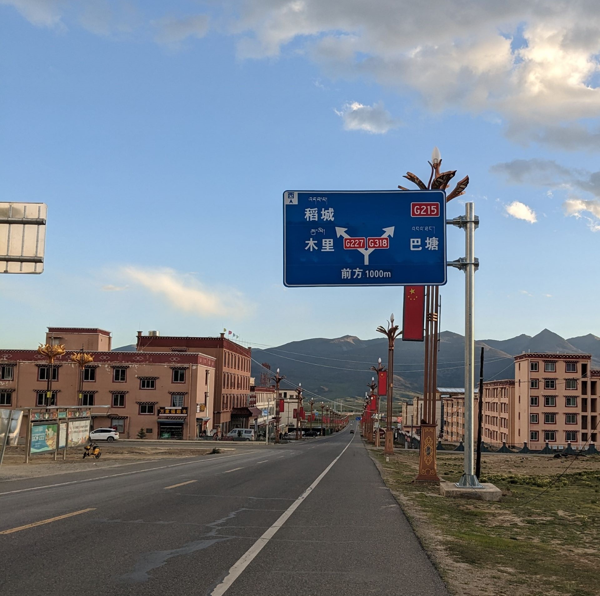

<!M PunctuationCompression>

# 四川之行

毕业告别了四年的大学生活，马上就要成为社畜了。想趁着入职前的这段窗口期去玩一玩。毕业前，室友曾想自驾 318，说实话，确实也有些心动。于是便起义想去四川。此前从未想到，原来四川离浙江是如此的遥远。小学初中的那些四川同学，跨越千里随父母来到沿海小镇，确实是不容易。我有位大学同学正是来自四川绵阳，与我在专业上都有共同的兴趣。很像我高中时的某位同学，不只是看上去。计划先到绵阳，然后去成都，最后再去川西。没想到B站圣地、世界最高城——理塘，就在川藏线上，就在四川境内，于是临时起意，想去圣地巡游。旅行，不总是计划完备的，想到便出发了。

网络有大量的川藏线、川西、成都的旅游行程分享。但几乎没有公共交通游川藏线或川西环线的，基本都是以自驾为主。公共交通在这种地区充满了不便。但我的财力和胆识不足以支持我自驾行四川。但到理塘有大巴车往来成都，所以圣地巡游还是可以完成的。

## 第一天 6/24 出发

原定计划从老家出发做大巴到宁波，然后从宁波坐飞机前往绵阳，然后再从绵阳前往川西。因为这班飞机下午出发，天黑前到达，时间和价格都都很不错。在疫情前，我都一直在宁波乡下小镇中生活，可以算是我的第二个故乡了。

宁波到的早，吃了个午饭，还顺便在月湖转了一圈。我在宁波从幼儿园读到高中毕业十来年，宁波的景点也没去几个，连书藏古今的天一阁都没进去过（这次也还是没进去）。

当天是阴天，还是春秋一水的空中绿皮 A320neo，起飞后在云层中穿行了半个多小时。然而天有不测风云，在快抵达绵阳时，飞机在上空盘旋了半个多小时等待降落。然后，因天气原因，机长决定备降双流。飞机在 3000 米的云中狂奔，老刺激了。不过没想到，我才第二次做飞机就遇到了这种情况。论我做过的交通工具的正点率，动车和高铁很少有遇到到站晚于发车时刻的，普速车的就要差一些了，再是中途不载客的大巴，主要是路上会堵车，然后是飞机，最次就是中途载客的大巴了。普速主要是优先级太低了，不时就要停车避让。飞机一般还有个到点，没有意外情况这个时间航司留的余地还是很大的，不过候机耗费的时间比较多。但是大巴就不一样了，发车基本还有个准信，但是到点基本就没得准了。

等到机组、机场和乘客扯完皮，出机场已经是晚上十点多了。飞机最后零点又飞去了绵阳，不知道还有几位乘客在上面一直坐着。临时定了一晚的房间，躺倒床上，今天的行程就这样结束了。于是就这样，意外地，首先到了成都。

## 第二天 6/25 武侯祠 & 康定

晚上就住在武侯祠边上，于是 10 点多起来退了房就去了武侯祠。成都作为大都市，黄绿蓝三家的共享单车出行非常方便，而且市区没有停车区限制。武侯祠那边上有条藏民聚居的街，挂着汉藏双语的招牌在卖些西藏的特产，不愧为西藏首府。武侯祠还是比较有名气的，类似园林、寺庙与博物馆的结合。首先进门的地方，和常见的寺庙布局类似，只不过里面供奉的不是佛像神仙，而是文官武将，各列左右。再向里走便是供奉着刘备和诸葛亮的地方了。庙旁边是一个陵园（惠陵，是刘备的墓，原来古代只有皇帝的墓才叫陵），里有个很大的圆形的墓，墓的外边有两层墙，中间就自然空成一个走道，墙刷了红漆，墙里两边种的都是竹子，很多人在这边拍照。红墙在各处感觉都是很热门的打卡景点（除南宋外，政治中心都不怎么在南方，南方很少看到红墙形式的建筑）。再向里走是类似园林的一小块地方。有个收费区域边上也有个开阔的广场，不知道那是后建成的还是以前是个什么，经典的宫殿前的广场设计，有个门，那个宫殿现在是武侯祠美术馆，不过那天好像没有开放。

武侯祠边上就是锦里，就是买吃的那种小巷子，哪景区都有的小吃以及一些本土的小吃。但是那里有很多茶馆和兼川剧表演的茶馆。那巷子并不是大直道，还有很多绿植和自然景观，我在里面绕了两圈才做出去。绕了一圈后有个茶馆的小二拦住我招呼我去增加下客流顺便尝口茶，我就屁颠屁颠进入。那伙计给我介绍体验了两三种茶，给我尝两种叶子的茶和一种花的茶，说实话，我对茶没什么品味和了解，也没尝出什么特别的韵味。不过当时，我看她那拆了几包茶，已经做好要破费的准备了。不过最后泡的那几包茶也没要我钱，还为我介绍了一些茶的知识，很不错。当然哪来的免费午餐，那街头表演都是带一带那狗皮膏药。店里向我推荐一款什么茶来着，记着不像叶子也不像花来着，是甘孜州的地产，也算是扶贫产品。不过到外地我一向是不买什么特产的，一是手上也没几个钱，准确的来说是不会买带礼品性质的产品。

这会已经是要十二点了，昨晚我买了下午一点多去康定的车，得抓紧吃了午饭出发了（那车站倒是市区，并不远）。找我那四川的同学推荐了几个店，陈麻婆豆腐和富春豆花，不知道，原来一家是这么有名，一家是苍蝇馆子，那边地图找了家还关门了。在那边上的店里点了份素豆花，原来这豆花就是清水煮嫩豆腐，但这不是内酯那样的嫩豆腐，也不是豆腐脑那种，是传统的豆腐。但啥料没有，就是点豆腥味，然后配个辣椒蘸水，但我是吃不怎么来辣的，基本也没蘸着吃。然后是个吃了个回锅肉盖浇饭。在四川四川人四川话感觉保留的很不错，听半天没听明白老板娘说的是回锅肉里有辣椒，搁杭州不太可能会有老板娘操着杭州话来问你。

吃完午饭就去那新南门坐车。去康定还是有不少人的，那车是 2+1 布局的豪华车，还有个平板可以看看电视，不过好像并不能用。我这票还是头几个位置，毕竟车一天有好几班，运力还是很充足的。到康定是已经修了高速的。四川的乡下，我看到很多种玉米的。从成都出发，到雅安，过泸定，就是康定了。过了大渡河，有差不多一个小时的车程全在隧道里，一个隧道接着一个隧道，穿过这山海拔就从 500 米升到了 2000 米。我成都中午一点出发的，到康定差不多是下午七点了，这边的太阳八点多才下山。过了雅安到泸定的路上有个天全服务区，是一个 318 国道主题的服务区，妥妥旅游局的阴谋。我到的那是康定的老城，离那康定情歌广场还是很近的。这里的建筑就是完全充满了藏族的气息了。吃了晚饭，沿河向上走就到。夕阳时有一群人围在一起跳广场舞。路上，店铺招牌，很多藏文，这里竟然会有沪上阿姨，之前喝茶百道还没发现，原来它那熊猫的商标，它是四川的牌子。很多穿着深红色袍子的藏人，像是僧侣。不过除僧侣样式的服装外大部分人都是不穿藏族传统服饰的（当然我也不知道谁是不是藏族人）。到了夜里就开始热闹起来了。有几位在桥上和广场上唱歌卖艺的人。如果从成都蹬个两轮，随夕阳来到康定来这溜溜的河的桥上听和唱个歌，的确是蛮浪漫的。不过一天蹬的到么。我原本还想做个公交车到新城区看一看，可那车简直比杭州早高峰的地铁还挤。下面的图是晚上八点左右拍的，四川在地理上是东七区了，晚上九点天才黑，虽然白天总时长是差不多的，但是因为和睡觉的时间重叠的少了感觉白天额外的长。

夜里回到青旅，这还是首次在外旅行住青旅，不过没想到青旅都还有国际组织。它开在不知道谁家的屋顶，不知道是木制的还是木制风格装修的，很有风格。屋子六个床铺，不过我就只是暂住一晚，明天一早就要出发去世界最高城————理塘。屋里的墙上写满了以前过客的话，可惜我身上没带着笔，就用钥匙在床头刻了刻。毕竟是钥匙刮墙，感觉不太好，不过想想都是五十步笑百步。那晚上，睡的不大好，有个人在打呼噜，第一来高海拔的地方，可能也不太适应。到理塘的车一天只有早上有几班，我没有那么多天可以在四川待，一个地方没有多少时间可以停留，坐车将是本次川西之旅的主弦律。

## 第三天 6/26 到达世界最高城

早上七点，天已经亮了，早上我难得吃到了一次油条和那灌水的豆浆，自打来杭州上大学后我就再也没吃到过油条（好吧，其实早餐店里还是有卖油条的，只是不是路边摊劣质大锅油现做现炸那种的了）和没有豆子的豆浆了（大家总是喜欢带上些豆渣渣，除了便利店里机器用粉冲的），可惜这油条，感觉没有以前那香味了。

去理塘是七座商务车。那个票务很邪门，我是在四川汽车客运票务网上买的，应该是四川政府的网站，另外还有个团子买票，票务网是没有手续费的。但是票务网买的票新南门那里的机器上是打得出票的，但是康定这里只有一个特定的机器上才出的了票（后边在理塘的时候，我必须到人工柜台才行，那个柜员让我在川藏运业，也就是甘孜州的客运公司的公众号上买）。这车在站里磨蹭来磨蹭去，原定七点半的八点多了才出发，下一班车都要走了。

驶出康定城区，第一个经过的地势高地就是折多山垭口，大概四千多海拔，这里有一个观景台，堵了十几分钟。这里原本应该是观雪台，可惜夏天雪都化了，就剩下一碎石子滩了。还得是自驾出行（四轮、两轮、双脚），坐大巴点到点只能透过窗户看看。在康定这边的山路，发卡弯心的草地上，可以看到很多车子摆着买咖啡（什么小资生活）。驶过垭口，车辆行驶在康定域内，平缓的山坡上。康定的机场便修建在大草地上。

一路下降，从山坡来到了山谷中的新都桥镇。出新都桥后沿着山谷而行，穿过群山下的隧道后，沿着溪流向雅江县进发。在一段狭窄的山谷之间，道路需要连读地通过发卡弯与大回环（进藏方向顺序：中古弄巴 1 桥、2 桥、卧龙寺大桥）调整高度（有什么这种山路、大桥和立交的驾驶游戏，欧卡的路太单调了）。中午到达雅江县，雅砻江穿县城而过。我们在雅江县的客运站休息 40 分钟。这里有提供自助打菜可以做午饭，虽然这里的店都是川菜店，我也不知道这里的人吃的该是四川菜还藏族菜，但是吃起来就和我在浙江吃到的普通快餐店里一般的家常菜。

过了雅江还剩下一半的路程。行驶在一望无际的草原上，就像是那张经典 Windows XP 壁纸一般。第一次看成群的耗牛和骑着摩托放牧的藏民。坐在副驾驶的乘客（康定到理塘的班车是用那种商务车运营，副驾驶一个位置，第一排三个位置然后后排四个位置）断断续续地在和司机聊天。司机在这条路上工作了十多个年头，曾经是拉货，现在是拉人。那位乘客看起来是到理塘跑业务去的。司机在打电话，他们生活在这边的人，说的是四川话还在藏族话呢。从雅江的一两千海拔到理塘的近四千海拔，可以直观地看到植被从阔叶林到针叶林到草原地变化。原来天路十八弯是真的有个地方叫天路十八弯，出雅江后翻过剪子弯山，需要快速地爬升高度，有一段密集的之字形盘山，取名天路十八弯。翻越剪子弯山后，我们就一直行驶高山草原之上了。

通过最后一个隧道就到达了，世界最高处——理塘！

我以为他停到理塘的新客运站里，没想到它是城区里面的，我的住宿订在新客运站边上，我还得折返走回去。理塘作为四川境内海拔最高的县城，真不是随便说说的，刚下车走了一段路到了理塘的东城门那里，感觉和慢跑过来一样。还好城里面有共享电单车，范围里刚好可以到客运站那里，不然走过感觉要累死在半路了。在旅馆放了包，骑着单车在他的运营范围先转了几圈。县域的整个城建面积很小，从东到西几个十几分钟就到头了。县域就是以 318 国道为主干道，路边主要都是些旅馆、饭馆、汽修之类的店，在广阔的大西部，通常要过百八十公里才能有一个人类聚居区，过雅江的下一个城区就是理塘了，在理塘有 318 国道和 227 国道分别以东西和南北走向穿过。沿 227 北上可以到达新龙、甘孜（甘孜州首府是康定）、色达，南下可以前往稻城。过了巴塘就进入西藏芒康了，我可以继续进发西藏，但是这样这趟旅行的耗时和开支就会大大增加，而且出了四川我就不知道西藏那边的班车情况了，不确定因素和风险大大增加，这趟 318 之行就到理塘为止了，往后有机会在来了（以后最好还是得自驾来，坐班车不太自由，而且大巴车隔着窗户怕拍照总是避免不了玻璃的反光）。

近距离观察它的这草地的时候，发现，原来它这的草不是我想象中的那种草坪里的像头发一样的标准的草，而是稀疏的像杂草一样的草和矮小密集的远看像青苔一样的草，近看感觉甚至还不如那杭州的荒地草坪，有些失望。在这个小县城，竟然还有蜜雪冰城、正新鸡排、书亦烧仙草和华莱士，我那老家那镇子都没有（24 年五一回去看到开了家蜜雪和正新，不过理塘好歹也是堂堂县级行政区，我那只是个镇子）。我去的那时候好像正好县里面学校放学（虽然说那边有时差，但是晚上七八点才放学还是有些太辛苦了吧，难不成他们十点才上学），接孩子放学的那些妇女穿着看起来就是非常藏族的样子了，灰红色的大袍子斜披在身上。

就在我坐在它们县政府边上的广场休息的时候，那广场上有个什么格萨尔王的雕塑，Google 的那垃圾手机电池突然从百分之十多一下就掉到了百分之零关机了，我还以为是电池高原反应不经用了，要回到就到酒店的话还要走一大段路，于是我找了一饭店借个电充。结果死活都充不进去，当时差点急死我了，幸好我还带了一部手机在身上，拿了个牙签把电话卡换了一下总算是又可以用了，随便吃了两口就赶紧结账回旅馆，当时身上的那部手机的摄像头是坏的，费了老大劲才向老板说明白我没法扫码付款，只能转账给他付钱，好在老板不是什么暴躁老哥。饭店门口就有个共享电单车，还好它那设计了二维码扫不成功还可以输车辆编号，不然我还是得走回去。回去我赶紧先把手机卡装到好的那部备用手机上（还好当时我手机带的多），发现我用充电宝充电那个手机又能充进去了。就在我骑回来的路上，半路感觉有雨滴打在我身上，然后晴空中就突然飘出一片乌云，我去这我要是走着回去就要成落汤鸡了。等我赶回旅馆，我还以为雨要下一阵子了，结果一会停了，乌云也散了，我再出去的时候地都快干了。这就是高原上的天气么。

充了会电，带着充电宝骑车去理塘县晃荡到了天黑，天黑差不多晚上九点了，明天早上六点半还要坐车回成都，今天就早点休息了。

## 第四天 6/27 日行千里

因为订的旅馆就在汽车站的边上，所以早上六点起来就可以了。昨晚蛮晚的时候听到一群人匆忙地入住，然后早上四五点又匆匆起床走了。到了车站里面已经有一些人在购票、等候了，然后就是阴间的售票机了，他识别不到我买的车票，无奈只好去柜台处理，好在取到了票。售票员给了我一个名片，让我去川藏运业的小程序上买，不要到那些第三方买（可我可是从政府网站买的，不是第一方也是该第二方吧，而且它还没有手续费）。还是有蛮多人坐这班车的，毕竟去成都一天就这一班车，我提前一晚购票差不多是过半的位置，不过作为城乡间的班车，还有一部分乘客是在中途上下车的。虽然这车预定是六点半发车的，不过惯例总要磨蹭一下。起床时六点的天还是灰沉沉的，现在天已经亮起来了。等乘客都到齐后就出发了，朝阳照在草地上，呈现出金色（日照金草地）。驶出理塘的路上，充满了清晨的感觉（冬日太阳透过模糊玻璃照亮灰暗屋子里空气中灰尘听到户外喇叭在播报天气和陈年木床与棉被的感觉，也可能只是没睡醒）。然后在驶出理塘的隧道前堵车了，隧道在施工只能两边车辆轮流通行。路上看到来的时候没注意到一个广告牌，原来杭州的钱塘对口支援理塘。返程的感觉总是要比来时更快，不过多时就行驶到了天路十八弯的路段，过了这一段路就要开始进入雅江了，过弯的时候看到有两个骑自行车进藏的。非常勇敢，这些骑行川藏的。从这里开始路边的山上就长满了针叶植物，然后就是阔叶植物。路途之中偶尔会有经过一些小镇，会有零落的一些乘客上车或者是让司机捎带一些货物。坐在我边上的几位乘客，好像是在理塘的工地上干工程的，这次去成都进行几天的培训。

一路上迷迷糊糊，过了雅江，在新都桥附近的一家饭店停下休息以及吃午饭，和之前来的时候一样，三十块钱自助选菜，看起来这家饭店应该是和那些客运公司合作的，饭店里有专门的司机休息处，另外看到巴塘到成都的车也刚好到这休息，靠这合作这饭店每天至少都有稳定客流。休息四十分钟后要开始下午的路程了。来的时候康定到雅江就开了一个上午，雅江到理塘又差不多开了一个下午，现在一个上午就开完了之前四分之三的路程。去理塘的时候康定那的雪山在我们的背后，只能看到一点，现在回程的时候就在我们的前面了，一大段路上都可以看到雪山。

从康定到成都就都是走高速的。下午六七点回到成都新南门，早上六七点到下午六七点，全程十二来个小时，五百多公里。

吃过晚饭继续逛成都，首先是成都的正中心天府广场，广场是毛泽东雕塑和四川科技馆，看网上说四川科技馆不好约，但还是约到了 30 号的。天府广场的整个商业都是修在地下的，而且在地下挖了一个巨大的圆形地铁站天井（这种能叫天井么）。天府广场再走一段路就是到了成都人民公园，那里放了很多大型灯笼在展示，不知道是什么活动还是什么。在公园里有一群老大爷大妈坐在椅子上扇风喝茶采耳侃大山，真是惬意。从人民公园出来再到边上的宽窄巷子，原来宽窄巷子是由宽巷子窄巷子和井巷子三条巷子共同组成的历史建筑商业街区。作为现代商业街区，虽然我感觉除了它的历史文化和建筑外没有什么可以吸引我的人无我有的东西，不过四川的这里总会有看戏喝茶的店，戏曲文化在这里传承得这么好么（也可能演的是那种现代化了的舞台剧）。

## 第五天 6/28 文殊院 & 太古里

上午逛了逛文殊院，上上下下这寺庙其实长的也差不多个样。出来吃了个甜水面，简直就是半生不熟的条状死面团配上甜口的辣椒红油（也有可能是我吃的那家手艺不精），还是冰粉合口味，我就喜欢吃果冻。

中午出来接着就去了太古里，原来是一个寺庙和一片古建筑风格奢侈品商圈。这城市核心一座庙，感觉和上海的静安寺差不多，但是就我看起来，成都的这个景观设计得就要比上海那更协调自然。太古里边上就是春熙路步行街，著名熊猫爬楼景观所在地。不过感觉大热天的街上外边的人比那商场里的人还多。就像 in77 各地大型商业步行街大体上也都差不多。

下午就是坐车去阿坝州的四姑娘山景区。在川西行进就是一路的翻山越岭。阿坝这边的气候明显感觉就要比甘孜那边湿润的多。进阿坝的路上，可以看到这边地质灾害留下的印记，废弃的道路，冲刷留下的乱石头滩。这边路上还在修高架轨道，之后这川西两边都可以通火车进去了。因为这边空气湿润，所以云雾缭绕。有一段盘山路，那完全就是在云里钻，连隧道里也全是雾，浓得前车尾灯都看不清楚。这能见度下还能超车，大概是路都背在脑子里了。

快天黑了才到四姑娘山景区边上，那边一共是分三个景点，从里到外是双桥沟、长坪沟和海子沟。开过来，长坪沟和海子沟都入口都差不多在一块，游客中心和核心的镇区也在那边，那边商业化程度也很高，双桥沟这边就没有什么了，就是沿路的一些人家。原本计划是去双桥沟，所以也就住在双桥沟这边。傍晚的时候就零星下了阵雨，到了晚上雨就变得越来越大。

## 第六天 6/29 四姑娘山

雨下了一整晚，早上起来还在下，路边河里的水位也明显涨了许多。

还好住的离景区门口并不远，结果到了发现因为昨晚的大雨，现在景区临时关闭了，我在那等了半个小时也没看到什么要开门的样子，我可没这时间在这干等着。长坪沟没有因为天气原因关闭，于是就退了改买了长坪沟的票。等我进去雨到不是很大了，而且还好我包里还有个雨衣（这雨衣还是大一的时候搬校区时候发的，没用上就一直留着包里了）。好在快到中午，雨渐渐就停了，太阳也开始出来了。虽然这边海拔也有三千来，但是可能是因为在山林里，氧气浓度高，爬起山来并没有特别觉得喘不过气。

下过雨环境的饱和度特别高，清新的空气，适人的温度，感觉还是很不错的，除了爬山爬得有些累（因为这其实是个山谷，所以一路其实并不是猛猛向上爬）。一路沿着山沟沟向里走，沟里的河就变得越来越宽，到上面就变成形成了一个大池塘，那河有一些光着杆子的树，可能原本长着树，然后水大的时候就被淹掉了，淹来淹去就成这样了。原本接着再向里边走还能走到那雪山山脚下，但是我下午还要回成都去，所以走到顶上那湖就折返了。

返程的时候天是晴的，但是到了盘山那段又是云里雾里，那雾里面还有一群人在山坡上露营，路边上还有摆摊的。

## 第七天 6/30 熊猫 & 科技馆

上午的行程是大熊猫基地，都来四川了那总得来看一下大熊猫。为了赶着开门进去，早上六点就起来出发了，到了那里还没开门那就已经是排队排得人山人海了。等到了我进去，感觉里面已经都是人了。门口那些都是室外的馆，因为来的早所以熊猫都还在外边活动。密密麻麻一圈人围着大院子里两三只熊猫，正不愧是国宝。尤其是熊猫花花的那里，简直里三层外三层一眼望不到头，果断放弃了。但是再向里边走，就都是室内的熊猫馆了，就没有多少人了。虽然隔着玻璃看，但相比露天的那些熊猫馆隔着老远望，距离要近得多。这个基地一堆馆和一堆馆之间修得很远，虽然还有半个园子没有逛，但是行程上只安排了一个上午，所以把主要的几个熊猫的地方看了就回去了。

下午的行程安排是参观四川科技馆，有一堆家长带着小孩儿来，的确里面都是科普内容，也有很多互动装置。一楼有几个类似于飞行员训练的装置可以体验，微微刺激还有些意思。楼上就是根据声光电各个主题的一些科普内容。

结束了科技馆的参观就准备出发去绵阳了，这是行程最后的一站了。不过发现，这边的高铁票都是和动车一个价，不像这边高铁就因为等级高就要贵一节。到了绵阳，火车站前就是城市的主干道了。住的地方就在火车站附近，走到那边，确实是一种经典的县城风格，旅馆看起来像是自建的房子。

晚上到那每个城市都会有的美食街去找些当晚饭吃。点了碗油茶，还没吃过这玩意，是类似粥一样的羹，然后再加像咪咪一样的可能是炸面条的什么的（原来叫馓子），最后再撒上些调料。不知道这东西和油和茶有什么关系，和茶可能还能扯一扯关系。怎么说呢，那炸面条还挺好吃的，那碗粥就吃不太来了（只接受甜的粥，就算是配咸的菜）。

## 第八天 7/1 绵阳 & 返程

早上起来，同学推荐去吃了个绵阳米粉，当时还没意识到辣的问题，随便选了个口味的，结果吃的我汗流浃背，待四川这么多天还是我吃到最辣的一顿（真好奇了，我其他吃的那些饭店快餐店，总不能全是针对我这外地人的吧，我都没觉得啥辣那本地人是怎么接受得了的）。

中午和同学一起吃了顿饭，看着是个什么老字号饭店。我还是头一回知道原来夫妻肺片是一道红油拌牛杂的凉菜，还以为是辣椒炒动物肺，之前都没吃过。而且虽然这肉片都泡在红油，但它是不辣的。包括麻婆豆腐它也并不算是辣的（是我刻板印象还是口味改良了还是预制菜）。没想到，我还以为他们这人顿顿离不了辣（也可能是我都在人口交流密集地区的原因）。

下午就返程回成都了，因为我都没想过我会带到现在，住店我都是一天一家定的，要坐飞机基本是没什么便宜的选择了，只能是坐火车回去了，绵阳这没什么前往东方的班次，得先绕回成都。即使是火车，临时买也不是很好买，坐动车回去的话，班次其实也不是很多，而且要从做到晚，屁股坐烂。慢车又真太慢了。所以是晚上坐卧铺，到了白天再换乘动车，这样还解决了今晚的住宿问题。买票时偶然从第三方软件里点出了个新的科技，远程的票都没有的时候但是短程的票还有的时候，就可以分段购买同一个班次的车票，一段一段拼起来。而且我就一个包，所以也就换个座位的事情。就这样以武汉作为中转站，夜里慢车到武汉，到了武汉再换乘动车回去。结果是从成都到杭州这一段路程被我切臊子一般切成了 5 班车次 9 张票。

回到成都后，买了些干粮就出发了，第一站是乘坐城际到达四川达州。到达达州后乘坐慢车下一站就是武昌站了，这一段路被我切成了：达州——万源——安康——武昌，三段。

## 第九天 7/2 杭州

早晨到达武昌站，和大部分城市的多个火车站类似，都是慢车一个站，动车一个站，需要坐地铁到武汉站继续行程。原来这条地铁线就是通往柏林的那条。下一站就是合肥南站，中途需要在麻城北站换座。到达合肥南后，下一站是安徽芜湖站，中途换座巢湖东站。到达安徽抽象地名之一——芜湖。最后一站，行程终点杭州西站，这次是直达了。不过说实话其实当时应该可以在武汉多停留一会的，毕竟这一站不是同站换乘要跨越城区，可以推一点时间出来在城区逛一下，而且到了东部之后车次的选择余地也多了。

第一次来杭州西站，新的车站看着就和那老旧的车站不一样，特别是整个大厅有个四叶草形状的穹顶，然后那里有个非常显眼的巨长的扶梯。整个衔接的地铁线用的也是充满科技感的蓝色灯光装饰。就是他这离我那城东太远了，而且因为它这个铁路线设计，所以大概是不大可能有同时停靠杭州西和杭州东（或南或城站）的车了。

## 写在最后

从 23 年 8 月份着手开始写，内容跟牙膏一样挤来挤去，总算是在 24 年 8 月份前写的差不多了。
